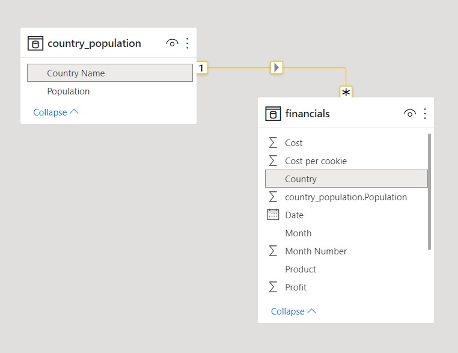
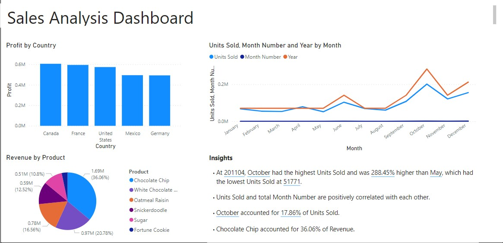
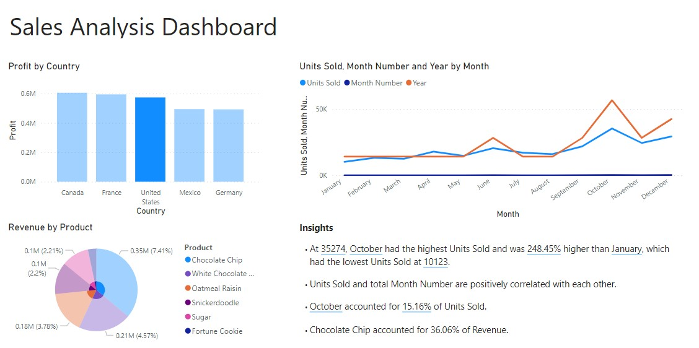

# Analyzing the Sales of a company using Power BI

### Dataset
* We have used Dummy sales data to create a dashboard
* The **Financials** table is imported through an online dataset (included in repo)
* While the **Countries** dataset is imported through an online website (https://en.wikipedia.org/wiki/List_of_countries_and_dependencies_by_population)
* The two tables are joined using the Country name

### Data Model

### Creating a Dashboard

We create a dashboard to analyze the performance of the product across various countries and months.

After applying a filter to select only "United States"

